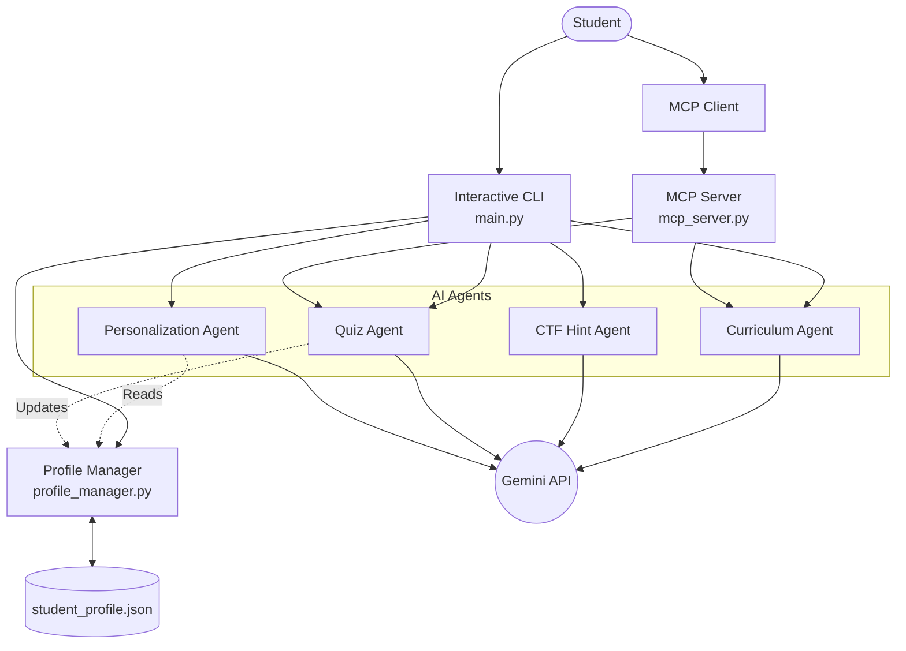

# SecureLearn Agent - AI-Powered Cybersecurity Education Assistant

## 🚩 Problem Statement
Cybersecurity students often face a steep learning curve. Finding structured, cohesive learning paths from scratch is challenging, getting stuck on Capture The Flag (CTF) challenges without any guidance can be demotivating, and tracking long-term progress across diverse cybersecurity topics is difficult. SecureLearn solves these three core problems using an intelligent, adaptive AI agent system.

## 💡 Solution
SecureLearn is a multi-agent system built using the Google ADK and powered by the Gemini API. It features four specialized sub-agents—CurriculumAgent, CTFHintAgent, QuizAgent, and PersonalizationAgent—working in tandem through an interactive CLI and an MCP server. By tracking user progress natively, the system ensures that students aren't just given generic answers, but are guided intelligently through their ethical hacking journey.

## 🏗️ Architecture



The project leverages four distinct sub-agents and a robust session memory system:

- **CurriculumAgent**: Dynamically generates structured, beginner-to-advanced learning paths for any cybersecurity topic (e.g., SQL Injection, XSS, Linux Privilege Escalation).
- **CTFHintAgent**: Acts as a mentor during CTF challenges. Instead of giving away the flag, it provides exactly 3 progressive hints to nudge the student in the right direction.
- **QuizAgent**: Generates technical multiple-choice questions to test the student's knowledge and evaluates answers with detailed explanations.
- **PersonalizationAgent**: Analyzes the student's learning history, quiz scores, and weak areas to intelligently recommend what topic to tackle next, ensuring proper difficulty progression.
- **Student Profile Memory**: A persistent JSON-based tracking system (`/data/student_profile.json`) that automatically records topics studied, calculates daily study streaks, and tracks "weak areas" (quiz scores under 70%) across sessions.
- **MCP Server**: A Model Context Protocol server running locally to securely expose the agentic tools to compatible MCP clients over Server-Sent Events (SSE).

## 🛠️ Tech Stack
- **Google ADK** (Agent Development Kit)
- **MCP** (Model Context Protocol)
- **Python 3.10+**
- **Gemini API** (Generative AI)
- **JSON-based persistent memory**

## 🚀 Setup Instructions

1. **Clone the repository:**
   ```bash
   git clone https://github.com/manivel-cyber-ai/SecureLearnAgent.git
   cd SecureLearnAgent
   ```

2. **Install dependencies:**
   ```bash
   pip install -r requirements.txt
   ```

3. **Configure Environment:**
   Copy the example environment file and insert your Gemini API Key:
   ```bash
   cp .env.example .env
   # Edit .env and add your GEMINI_API_KEY
   ```

4. **Run the Application:**
   Start the interactive CLI:
   ```bash
   python main.py
   ```
   Or start the MCP Server:
   ```bash
   python mcp_server.py
   ```

5. **Demo Mode:**
   If you want to evaluate the pipeline without utilizing a live API key, set `DEMO_MODE=true` in your `.env` file to use pre-written, high-quality sample responses.

## 🎯 Why This Project
Built by a cybersecurity student with hands-on CTF competition experience, this tool was designed to address the real, everyday gaps in how students learn ethical hacking. Rather than spoon-feeding answers, SecureLearn mentors the student, mimicking the experience of having a seasoned senior hacker guiding you through a challenge.

## 🔮 Future Work
- **Platform Integrations**: Utilizing the TryHackMe and HackTheBox APIs to automatically pull live CTF context.
- **Web Interface**: Transitioning the CLI and MCP backend into a fully-fledged Flask web application.
